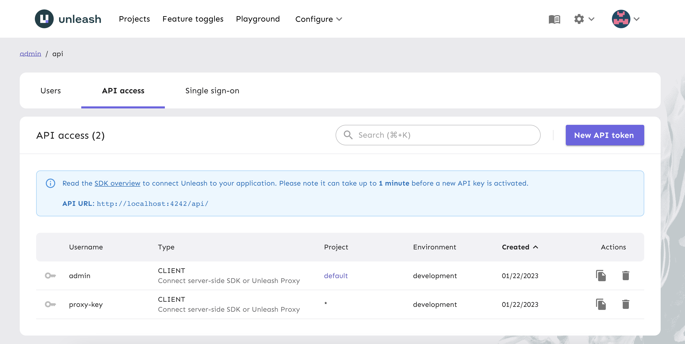
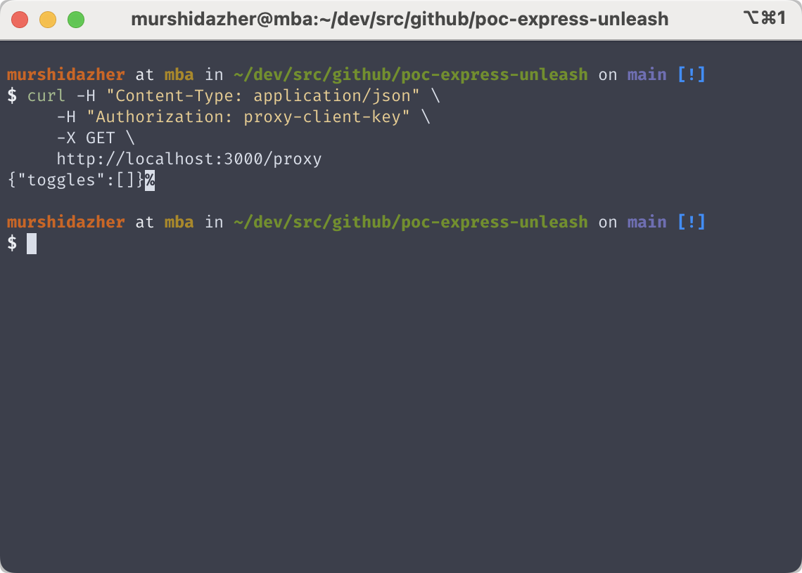
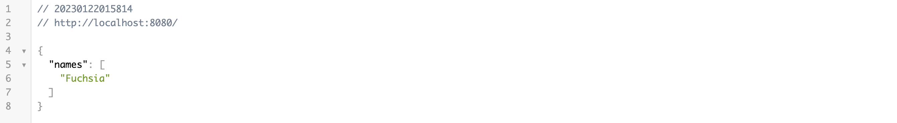
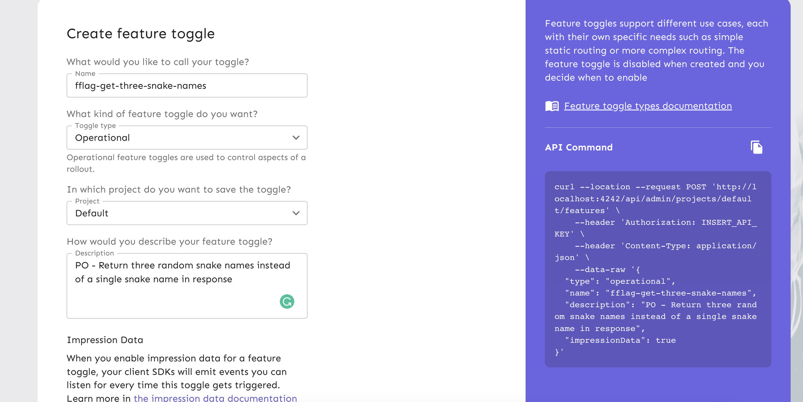
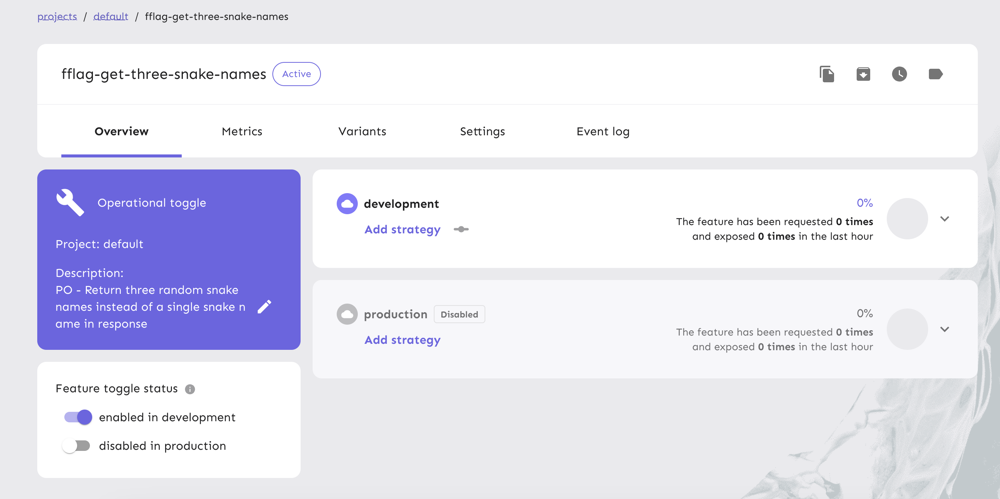
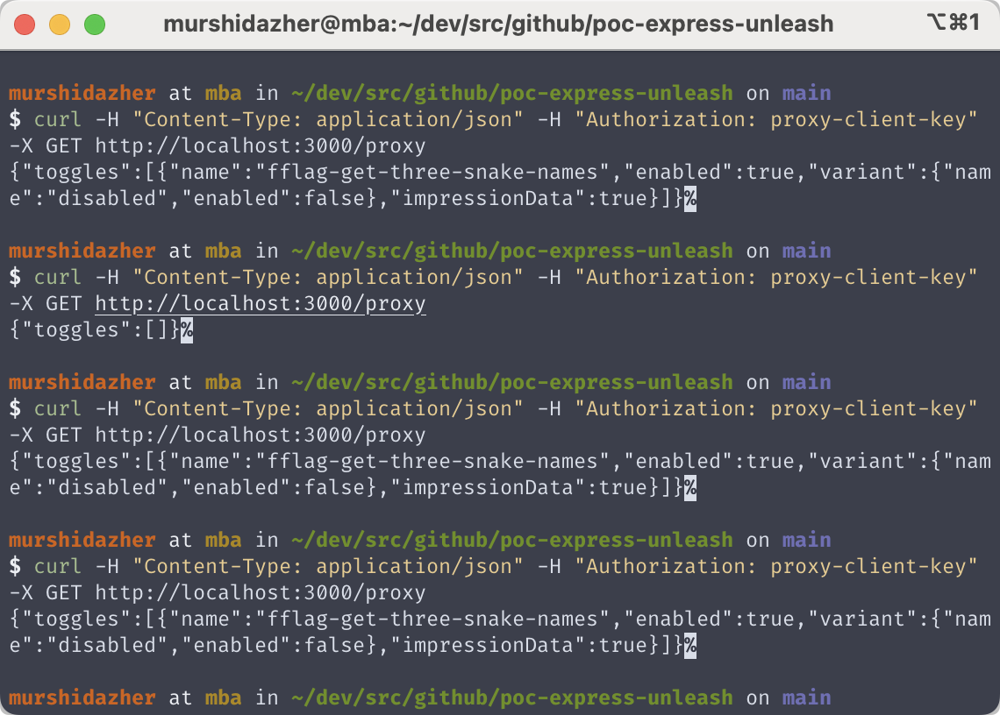
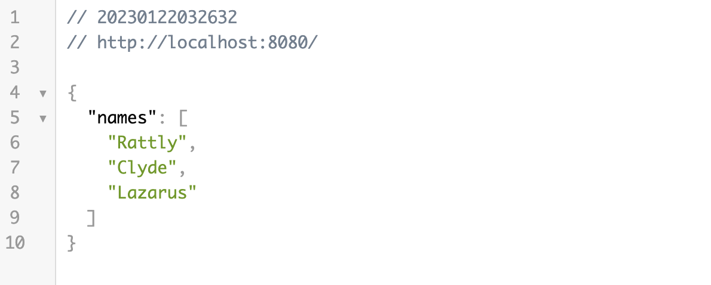
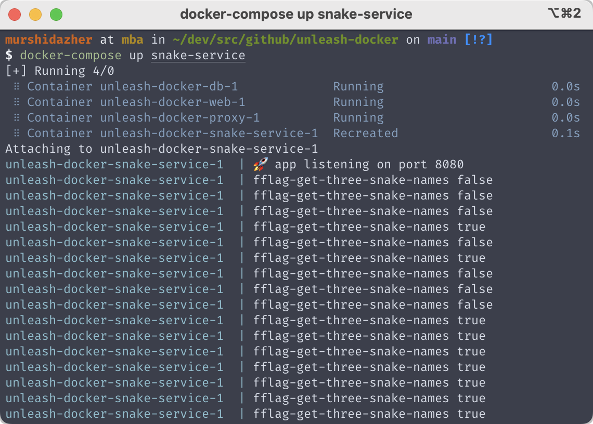
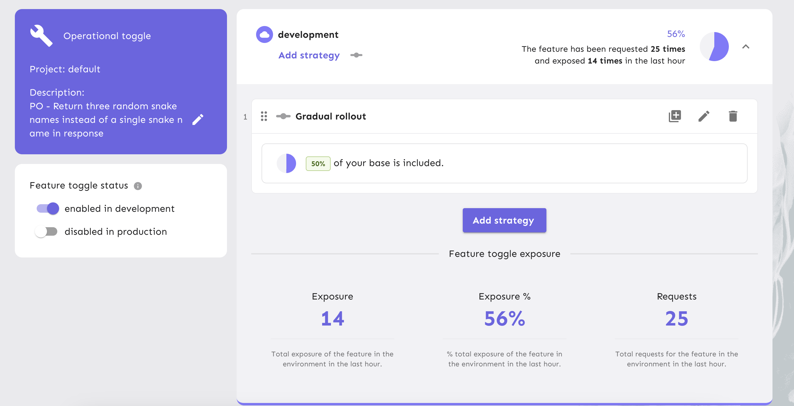

# [poc-express-unleash](https://github.com/murshidazher/poc-express-unleash)

> 🚀 A proof of concept for using Unleash feature flag service with express

- Unleash an open-source software for managing feature flags for trunk-based development.
- Documentation for Getting started with Unleash could be found [here](https://docs.getunleash.io/reference/deploy/getting-started)
- Docker compose file and setup can be found [here](https://github.com/Unleash/unleash-docker)

## Table of Contents

- [poc-express-unleash](#poc-express-unleash)
  - [Table of Contents](#table-of-contents)
  - [Getting Started](#getting-started)
    - [Docker-compose](#docker-compose)
    - [Setting up Unleash Proxy](#setting-up-unleash-proxy)
      - [User accounts](#user-accounts)
  - [Snake Service](#snake-service)
    - [Adding a Project](#adding-a-project)
    - [Adding a feature flag](#adding-a-feature-flag)
    - [Rebuild the image](#rebuild-the-image)
  - [Common issues](#common-issues)
    - [Work locally with this repo](#work-locally-with-this-repo)
  - [Additional Links](#additional-links)
  - [Thoughts](#thoughts)
  - [LICENSE](#license)

## Getting Started

### Docker-compose

> 🐳 Make sure that the docker service is up and running.

1. Clone the `unleash-docker` repository. `git clone git@github.com:murshidazher/poc-express-unleash.git`
2. Run `docker-compose build` in repository root folder.
3. Run `docker-compose up` in repository root folder.

### Setting up Unleash Proxy

> Documentation could be found [here](https://docs.getunleash.io/how-to/how-to-run-the-unleash-proxy).

An unleash proxy is need as a way for client-sdks to consume feature flags in the application.

- Open the browser and go to [localhost:4242](http://127.0.0.1:4242)
- Add the default admin credentials and login
- Go to Configure -> API access -> Configure the proxy
- Create a token for the `unleash-proxy` and add it to the `docker-compose`.
  <details>
    <summary>Example screen shot for configured client key</summary>
    
  </details>

- `docker-compose up proxy` to restart the proxy.
- Verify that the proxy is running

  ```sh
  curl -H "Content-Type: application/json" \
     -H "Authorization: proxy-client-key" \
     -X GET \
     http://localhost:3000/proxy
  ```

  <details>
    <summary>Example curl request for fetching flags using proxy key</summary>
    
  </details>

#### User accounts

- Once started up, you'll have a user with
  - username: `admin`
  - password: `unleash4all`

## Snake Service

> An example small api to fetch snake names

- By default, the service only returns a single snake name.
- A new product outline has come in to add a new modification to send multiple snake names instead of one.
- Since you're doing a truck-based development you need to wrap the changes inside a feature flag.
- We will be using the node.js SDK, but you can use whatever the SDK you prefer. The list of available SDK are [here](https://docs.getunleash.io/reference/sdks#official-sdks).

  <details>
    <summary>Default response of snake-name api</summary>
      
  </details>

### Adding a Project

> 💡 Open-source version only get the `default` project, we cant create more projects. 😞

- Select the `default` project.

### Adding a feature flag

> 🎏 Check out the [feature flags documentation](https://docs.getunleash.io/reference/feature-toggle-types#feature-toggle-types) for the types of feature flag that could be created.

- You can also use the [unleash-client-proxy](https://www.npmjs.com/package/unleash-proxy-client) with [node-fetch](https://www.npmjs.com/package/node-fetch/v/2.6.1) module to connect to the proxy instead of connecting to the server directly using API key.
- But this example uses the `unleash-client` SDK to directly connect since the communication would be amount services.

For this example, lets create a flag called `fflag-get-three-snake-names`
  <details>
    <summary>using the shell</summary>
      ```sh
        curl --location --request POST 'http://localhost:3000/api/admin/projects/default/features' \
          --header 'Authorization: proxy-client-key' \
          --header 'Content-Type: application/json' \
          --data-raw '{
        "type": "operational",
        "name": "fflag-get-three-snake-names",
        "description": "PO - Return three random snake names instead of a single snake name in response",
        "impressionData": true
      }'
     ```
  </details>

  <details>
    <summary>using the UI</summary>
      
      
  </details>

- Enable the flag in development environment and gradual rollout to 50%

  <details>
    <summary>Enable the flag</summary>
      
  </details>

  <details>
    <summary>Requesting fflag with 50% gradual rollout</summary>
      
  </details>

- After feature flag response

<details>
    <summary>Getting the new feature</summary>
      
      
      
  </details>

### Rebuild the image

You need to rebuild the docker-image after any changes,

```sh
docker-compose build snake-service
docker-compose up snake-service
```

## Common issues

### Work locally with this repo

> 🌟 This section is adapted from adapted from [unleash-docker docs](https://github.com/murshidazher/unleash-docker#work-locally-with-this-repo).

Start by cloning this repository.

The unleash community has set up `docker-compose` to start `postgres` and the `unleash server` together. This makes it really fast to start up `unleash` locally without setting up a database or node.

```sh
docker-compose build
docker-compose up
```

On some computers, the database won't start in time for `Unleash` the first time you run this.
If Unleash fails to reach the database, `docker-compose restart web` usually resolves the issue.

## Additional Links

- To give context to unleash, refer to this section of the [documentation](https://docs.getunleash.io/reference/sdks/node#unleash-context).
- For custom auth strategy, example if you need to enable a feature for QA users with some email address. Refer to this section of the [documentation](https://docs.getunleash.io/reference/sdks/node#custom-strategies)
- For custom redis storage, refer to this section fo the [documentation](https://docs.getunleash.io/reference/sdks/node#custom-store-provider) and [client-proxy-sdk](https://github.com/unleash/unleash-proxy-client-js#custom-store).

## Thoughts

My thoughts on Unleash,

- 🟢 Great interface and easy setup
- 🟡 Would've been great if there was an extendible db setup other than PostgreSQL (ex. MongoDB)
- 🔴 Pegging the number of project to 1 which is only the default project. (Open-source)
- 🔴 The user access control feature for individual projects is only available for paid versions. (Open-source)

## LICENSE

2023 &copy; [Unleash](https://github.com/Unleash/unleash-docker/blob/main/LICENSE.md) & [Murshid Azher](./LICENSE).
